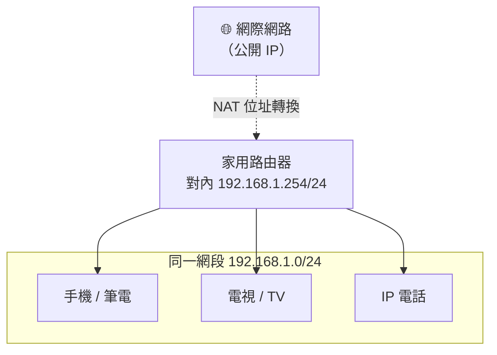
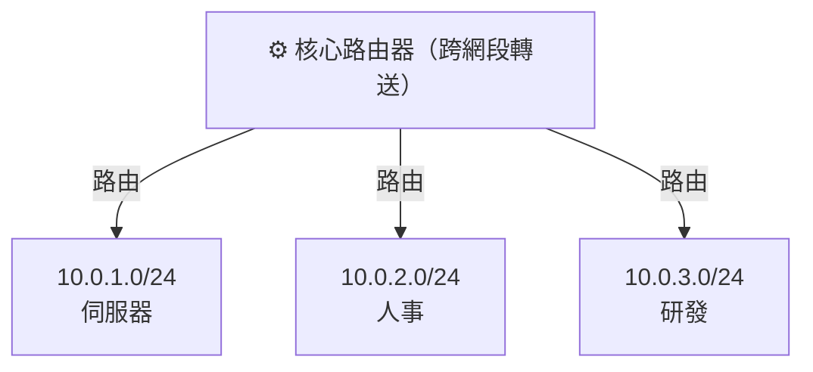

# 網路基礎：DHCP、固定 IP、網段、Ping 與路由器

> 研究日期：2026-08-10
> 範圍：家用／企業區域網路的入門觀念——DHCP 與固定 IP 的差異、私有 IP 網段（192.168.x / 10.x）、為什麼 `ping` 只在同網段才通、不同網段為什麼必須靠路由器，最後補上傳輸層（TCP／UDP）與整個協定分層的概念。資料來源一律為 IETF 第一方標準文件（RFC）。

## 目錄

- [一、DHCP vs 固定 IP（Static IP）](#一dhcp-vs-固定-ipstatic-ip)
- [二、網段與私有 IP：192.168.x 與 10.x](#二網段與私有-ip192168x-與-10x)
- [三、為什麼 ping「同網段才通」](#三為什麼-ping同網段才通)
- [四、不同網段為什麼需要路由器](#四不同網段為什麼需要路由器)
- [五、傳輸層（Transport Layer）：TCP 與 UDP](#五傳輸層transport-layer-tcp-與-udp)
- [重點總結](#重點總結)
- [參考資料](#參考資料)

---

## 一、DHCP vs 固定 IP（Static IP）

**固定 IP（Static IP）**：由人員手動把 IP 位址、子網遮罩、預設閘道、DNS 等參數逐一寫進裝置設定，不會自動改變，也不依賴任何伺服器。

**DHCP（Dynamic Host Configuration Protocol，動態主機設定協定）**：由 RFC 2131 定義的 client–server 協定，主機開機後自動向 DHCP 伺服器索取 IP 與其他設定參數 [1]。

### 1.1 DHCP 其實有三種分配模式

很多人把「DHCP」直接等同於「每次拿到不一樣的 IP」，但 RFC 2131 §1 明確定義了 **三種** 配置機制 [1]：

| 模式 | RFC 2131 原文 | 行為 | 等於日常說的 |
|------|---------------|------|--------------|
| **Automatic allocation**（自動分配） | "DHCP assigns a permanent IP address to a client" | 配給 client 一個**永久** IP | 「DHCP 發固定 IP」 |
| **Dynamic allocation**（動態分配） | "DHCP assigns an IP address to a client for a limited period of time" | 配給一個**有限期**的 IP，租約到期可回收再用 | 一般家用／企業最常見的「DHCP 自動發 IP」 |
| **Manual allocation**（手動分配） | "a client's IP address is assigned by the network administrator, and DHCP is used simply to convey the assigned address to the client" | IP 由網管指定，DHCP 只負責把指定值傳給主機 | 「DHCP 保留位址 / reservation / 綁 MAC」 |

換句話說，**「固定 IP」與「DHCP」並不是互斥的兩條路**：

- 完全手動寫死 → 真正的 Static IP（完全不碰 DHCP）。
- DHCP automatic / manual allocation → 結果也是固定 IP，只是由 DHCP 統一發派，方便管理。
- DHCP dynamic allocation → 才是「每次可能不同」的動態 IP。

> RFC 2131 §1.6 的設計目標之一明確寫道：「DHCP must coexist with statically configured, non-participating hosts」——也就是固定 IP 主機與 DHCP 主機**可以同時並存**於同一個網路 [1]。

### 1.2 DHCP 怎麼拿到位址（DORA 四步）

RFC 2131 §3.1 描述了主機首次取得位址時的訊息交換，業界簡稱 **DORA** [1]：

1. **D**HCPDISCOVER — client 在本地實體子網**廣播**一個「有誰是 DHCP 伺服器？」的請求。
2. **O**FFER（DHCPOFFER）— 每個收到請求的伺服器回應一個可用的 IP（放在 `yiaddr` 欄位）與其他設定參數。
3. **R**EQUEST（DHCPREQUEST）— client 從多個 Offer 中挑一個，正式向該伺服器請求。
4. **A**CK（DHCPACK）— 伺服器確認配發，client 正式取得該位址。

### 1.3 租約（Lease）

動態分配出來的位址有期限，這個期限稱為 **lease（租約）** [1]：

> 「the period over which a network address is allocated to a client is referred to as a 'lease'. The client may extend its lease with subsequent requests. The client may issue a message to release the address back to the server ... The client may ask for a permanent assignment by asking for an infinite lease.」

也就是說，租約可以延長、可以主動釋放，也可以要求「無限期租約」變成實質的固定 IP。

### 1.4 什麼時候該用哪個？

| 情境 | 建議 |
|------|------|
| 員工電腦、手機、訪客裝置 | DHCP 動態分配（省事、位址可重複使用） |
| 印表機、NAS、監視器、伺服器 | DHCP 保留位址（manual allocation）或固定 IP（要穩定可連） |
| 需要嚴格管控、不便用 DHCP 的環境 | 純固定 IP（手動設定） |

---

## 二、網段與私有 IP：192.168.x 與 10.x

### 2.1 三段私有 IP 位址

RFC 1918 §3 由 IANA 保留了三個 IPv4 位址區塊，供**私有網路**使用 [2]：

```
10.0.0.0        -   10.255.255.255   (10/8 prefix)        ← 24-bit 區塊
172.16.0.0      -   172.31.255.255   (172.16/12 prefix)   ← 20-bit 區塊
192.168.0.0     -   192.168.255.255  (192.168/16 prefix)  ← 16-bit 區塊
```

這三段的重點特性（RFC 1918 §3、§5）[2]：

- **不需向 IANA 或任何註冊機構申請**，任何企業都能自由使用，因此位址只在自己的網路裡唯一，跨企業會重複。
- **不能直接在公開網際網路上路由**。RFC 1918 明文規定：「Because private addresses have no global meaning, routing information about private networks shall not be propagated on inter-enterprise links, and packets with private source or destination addresses should not be forwarded across such links.」[2] → 這就是為什麼家用 192.168.x / 10.x 的裝置要上網，必須靠路由器做 **NAT（位址轉換）**，把私有 IP 換成公開 IP。

> 你家裡的 `192.168.1.x` 與朋友家的 `192.168.1.x` 是兩個完全獨立的網路，互不相干——因為這些位址只在自己的私有網路裡有意義。

### 2.2 網段（Subnet）怎麼定義：CIDR 與前綴長度

「網段」對應的正式概念是 **CIDR 前綴（prefix）**。RFC 4632 §3.1 定義了斜線記法 [3]：

> 「a prefix is shown as a 4-octet quantity ... followed by the `/` (slash) character, followed by a decimal value between 0 and 32 that describes the number of significant bits.」

舉例（RFC 4632 §3.1 原例）[3]：

- `172.16.0.0/16`：前 16 bit 是網路部分，遮罩 `255.255.0.0`。
- `192.168.99.0/24`：前 24 bit 是網路部分，遮罩 `255.255.255.0`。

`/24` 是家用網路最常見的設定：前三個數字（前三個 octet）是「網段」，第四個數字才是主機編號。例如 `192.168.1.0/24`：

| 項目 | 位址 | 說明 |
|------|------|------|
| 網路位址 | 192.168.**1.0** | 代表整個網段（不可指派給主機） |
| 可用主機 | 192.168.1.1 ～ 192.168.1.254 | 共 254 個 |
| 廣播位址 | 192.168.**1.255** | 對整個網段廣播用 |

### 2.3 「同網段」的判斷

兩台主機是否同網段，看的不是數字長得像不像，而是**前綴（網路部分）是否相同**：

- `192.168.1.10/24` 與 `192.168.1.20/24` → **同網段**（前三段都是 192.168.1）。
- `192.168.1.10/24` 與 `192.168.2.10/24` → **不同網段**（192.168.1 ≠ 192.168.2）。
- `192.168.1.10/24` 與 `10.0.0.10/24` → **不同網段**（連開頭都不同，還分屬不同 RFC 1918 區塊）。

> 用戶筆記中的「192.168.1 vs 10」其實就是跨了 RFC 1918 的兩個不同區塊，必然是不同網段。

---

## 三、為什麼 ping「同網段才通」

### 3.1 ping 走的是 ICMP Echo

`ping` 使用的協定是 **ICMP**，定義於 RFC 792。其中兩個訊息類型構成 ping 的核心 [4]：

- **Type 8 = Echo（回聲請求）**：來源主機送出。
- **Type 0 = Echo Reply（回聲回應）**：目的地主機回傳。

RFC 792 對 Echo 的說明：「The data received in the echo message must be returned in the echo reply message.」——也就是目的地必須把收到的資料原封不動回傳 [4]。ping 就是送 Echo、等 Echo Reply，用有沒有收到回應、往返時間多長，來判斷連線是否通。

### 3.2 但 ICMP 封包要送達，得先過 ARP 這一關

IP 封包（包含 ICMP Echo）要在乙太網路上實際傳送之前，傳送端必須先知道**目的地的硬體（MAC）位址**，這一步靠 **ARP（Address Resolution Protocol，位址解析協定）**，定義於 RFC 826。

ARP 的運作（RFC 826「Packet Generation」）[5]：

> 當封包往下傳到資料鏈結層時，「routing determines the protocol address of the next hop ... address resolution is needed」——傳送端先查自己的 ARP 表，查不到時就「generates an Ethernet packet ... It then causes this packet to be **broadcast to all stations on the Ethernet cable**」。

關鍵在於：**ARP 請求是廣播（broadcast）**，只會在**本地乙太網路／同一個廣播網域**裡傳送。

### 3.3 所以「同網段才通」的真相

把上面兩件事串起來：

1. **同網段**：目的地 IP 在本地廣播網域內 → ARP 廣播找得到目的地的 MAC → ICMP Echo 封包直接送達 → 對方回 Echo Reply → **ping 通**。
2. **不同網段**：目的地 IP 不在本地廣播網域 → ARP 廣播根本到不了對方（路由器預設**不轉送廣播**）→ 送端找不到目的地的 MAC → 封包無法直接送達 → **ping 不通**（在沒有設定閘道的情況下）。

> 注意：ping 不通的原因不只這一種（防火牆可能擋掉 ICMP、目的地離線等）。但在「兩台機器 IP 設好、卻跨網段直連」這個最單純的測試情境裡，不通的根本原因就是 **ARP 廣播過不了網段邊界**。

---

## 四、不同網段為什麼需要路由器

### 4.1 路由器（Router）的角色

每個網段（子網）都是一個獨立的**廣播網域（broadcast domain）**。ARP 廣播不會跨越網段邊界，所以兩個不同網段之間要互通，必須有一台能在**第三層（網路層, L3）**轉送封包的設備——也就是**路由器（router）**。

路由器做兩件事：

1. **每個網段都有一個介面**（例如 router 在 `192.168.1.0/24` 有 `192.168.1.254`，在 `192.168.2.0/24` 有 `192.168.2.254`），兩邊都「直接連接（directly connected）」。
2. 收到封包後，**解開第二層（MAC）標頭，讀目的 IP，查路由表**，再依路由表把封包從正確介面送出去，並在新的網段上重新用 ARP 解析下一站的 MAC。

RFC 826 的那句話再次印證了這個分工：「routing determines the protocol address of the next hop」——**路由（routing）是第三層的事，正是路由器的職責**，而 ARP 只負責「下一站」在本地網段內的位址解析 [5]。

### 4.2 預設閘道（Default Gateway）

對一般主機來說，當它發現目的 IP **不在自己的網段**時，不會嘗試直接 ARP 對方，而是把封包交給它設定好的 **預設閘道**（也就是路由器的本地介面 IP）。流程是：

1. 主機判斷「目的 IP 不在我網段」→ 查路由表 → 下一站是預設閘道。
2. 主機用 ARP 解析**閘道（路由器）**的 MAC，而不是目的地的 MAC。
3. 封包在 L2 送給路由器；路由器再依自己的路由表轉送到目的網段。

> 如果主機**沒設閘道**，或閘道設錯，跨網段的封包就沒有出路——這正是實驗／測試時「ping 不同網段不通」最常見的原因。

### 4.3 「不同階層的網段」是什麼意思

把網路想成分層：



家用情境通常只有**一個網段**（例如 `192.168.1.0/24`），所有裝置同網段，彼此 ARP 可達，所以互 ping 都通，也都能透過那台路由器上網。

企業／較大網路則會**切分多個網段**（每個部門、每個樓層、每個 VLAN 一段），再用路由器串起來：



每一段都是獨立廣播網域；**路由器既負責跨網段轉送，也順便把廣播限制在各網段內**（避免廣播風暴蔓延整個公司）。這就是「不同階層的網段要路由器」的實質意義。

---

## 五、傳輸層（Transport Layer）：TCP 與 UDP

前面四節講的都是「封包能不能送到位」的問題（L2／L3 連通性）。但應用程式（瀏覽器、郵件、聊天）需要的不是「送一個 IP 封包」，而是「可靠地把一串資料傳完」。這一層由 **傳輸層（Transport Layer）** 負責，主角是 **TCP** 與 **UDP**。

### 5.1 先把整個分層看清楚

RFC 1122 §1.1.3 把 Internet 協定套件定義成四層 [8]：

| 層級 | 名稱 | 代表協定 | 負責 |
|------|------|---------|------|
| L4 | Application（應用層） | HTTP、FTP、SMTP、DNS、SSH | 使用者服務 |
| L3 | **Transport（傳輸層）** | **TCP、UDP** | 端對端資料傳送、可靠性、流量控制 |
| L2 | **Internet（網路層）** | **IP、ICMP、IGMP** | 跨網段定址與路由 |
| L1 | Link（鏈結層） | Ethernet、Wi-Fi、**ARP** | 在實體網段上傳送訊框 |

把前面學的東西對號入座：

- `ping` = ICMP → **L2 網路層**。RFC 1122 明文：「ICMP is a control protocol that is considered to be an integral part of IP」[8] → 這就是為什麼 ping 只測「IP 層通不通」，跟 TCP 無關。
- ARP、乙太網路 = **L1 鏈結層**。
- DHCP = 用 **UDP** 承載（UDP port 67／68）→ 在 L3 之上跑。
- 路由器在 **L2（網路層）** 看 IP 位址做轉送。

> 一個關鍵觀念：每一層只跟相鄰層打交道——傳輸層把資料交給 IP（L2）去送，IP 再交給鏈結層（L1）去實際傳。所以 **TCP 不關心網段、不關心路由**，那是底下兩層的事；TCP 只關心「兩端主機之間這條邏輯連線」。

### 5.2 TCP 的核心特性

TCP 目前的權威規格是 RFC 9293（2022 年，取代 1981 年的 RFC 793）。§2.2 開宗明義 [6]：

> 「TCP provides a **reliable, in-order, byte-stream service** to applications.」

四個關鍵字拆開來看（同樣出自 §2.2）[6]：

- **連線導向（connection-oriented）**：「TCP is connection oriented」——傳資料前要先建立連線，傳完要關閉。
- **可靠（reliable）**：「TCP reliability consists of detecting packet losses (via sequence numbers) and errors (via per-segment checksums), as well as correction via retransmission.」——用序號偵測丟失、用檢查碼偵測錯誤、用重傳修正。**IP 本身不保證送達**（RFC 1122 稱 IP「providing no end-to-end delivery guarantees」[8]），是 TCP 在這層補上可靠性。
- **有序（in-order）**：接收端依序號重組，應用程式看到的是順序正確的位元流。
- **位元流（byte-stream）**：沒有「訊息邊界」的概念，就是一條連續的位元組流（對比之下 UDP 保留訊息邊界）。

TCP 表頭（RFC 9293 §3.1）幾個關鍵欄位 [6]：

| 欄位 | 大小 | 作用 |
|------|------|------|
| Source / Destination Port | 各 16 bit | 辨識兩端的應用程式（一個 IP 上可同時跑很多服務） |
| Sequence Number | 32 bit | 這個區段的資料在位元流中的位置（可靠、有序的基礎） |
| Acknowledgment Number | 32 bit | 「我已正確收到這裡，下一步期待收到這個號碼」（確認機制） |
| Control flags | — | **SYN**（建立連線）、**ACK**（確認）、**FIN**（結束連線）、**RST**（重置）、PSH、URG |
| Window | 16 bit | 我還能接收多少資料（**流量控制 flow control**） |
| Checksum | 16 bit | 偵測傳輸錯誤 |

### 5.3 三向交握（Three-Way Handshake）

TCP 建立連線用「三向交握（three-way handshake）」，RFC 9293 §3.5 開宗明義 [6]：

> 「The 'three-way handshake' is the procedure used to establish a connection.」

流程（以 RFC 9293 §3.5 的例子：A 的起始序號 100）[6]：

1. **SYN**：A → B，「我想連線，我的起始序號是 100。」（A 進入 `SYN-SENT`）
2. **SYN + ACK**：B → A，「收到（ack = 101，代表序號 100 我收到了）；我也建立連線，我的起始序號是 X。」（B 進入 `SYN-RECEIVED`）
3. **ACK**：A → B，「收到你的 SYN（ack = X+1）。」（兩端都進入 `ESTABLISHED`）

三步走完、連線才算建立，接下來才能傳應用資料。RFC 9293 也說明為什麼要三步而不是兩步：「The principal reason for the three-way handshake is to prevent old duplicate connection initiations from causing confusion.」[6]——為了防止舊的、重複的連線請求造成混淆。結束連線則用 FIN 做類似的四次交握。

### 5.4 UDP：輕量、不保證

UDP（User Datagram Protocol，RFC 768）是 TCP 的對照組。RFC 768 開頭就講明白 [7]：

> 「This protocol is transaction oriented, and **delivery and duplicate protection are not guaranteed**. Applications requiring ordered reliable delivery of streams of data should use the Transmission Control Protocol (TCP).」

UDP 表頭只有 4 個欄位、共 8 bytes（RFC 768「Format」）[7]：Source Port、Destination Port、Length、Checksum——**沒有序號、沒有確認、沒有重傳、也不建立連線**。好處是快、省資源、延遲低。

### 5.5 TCP vs UDP 怎麼選

| 特性 | TCP | UDP |
|------|-----|-----|
| 連線 | 要（三向交握） | 不用 |
| 可靠性 | 保證送達、不丟、不重複、有序 | 不保證 |
| 順序 | 保證 | 不保證 |
| 速度／延遲 | 較高（握手、確認、重傳） | 較低 |
| 表頭大小 | 20 bytes 起 | 固定 8 bytes |
| 常見應用 | 網頁(HTTP)、郵件(SMTP)、檔案傳輸(FTP)、SSH | DNS 查詢、DHCP、視訊／語音串流、線上遊戲 |

> 判斷原則：**「資料不能錯、不能少」用 TCP；「快比準確重要，或應用程式自己會處理可靠性」用 UDP。**

---

## 重點總結

| 觀念 | 一句話 | 依據 |
|------|--------|------|
| 固定 IP vs DHCP | 固定 IP 手動寫死；DHCP 自動發派，且 DHCP 也涵蓋「發固定 IP」的automatic/manual 模式 | RFC 2131 §1 |
| 192.168.x / 10.x | 是 RFC 1918 的私有位址，不能直接上網，要靠 NAT | RFC 1918 §3 |
| 網段怎麼分 | 由 CIDR 前綴長度（如 /24）決定網路部分 | RFC 4632 §3.1 |
| ping 的協定 | ICMP Echo（Type 8）／Echo Reply（Type 0） | RFC 792 |
| 同網段才 ping 得通 | 因為 ARP 是本地廣播，過不了網段邊界 | RFC 826 |
| 跨網段要路由器 | 不同網段＝不同廣播網域，要靠 L3 路由器轉送 | RFC 826 + RFC 4632 |
| TCP vs UDP | TCP 可靠、有序、連線導向；UDP 輕量、不保證 | RFC 9293 / RFC 768 |
| 分層觀念 | TCP／UDP 在 L3 傳輸層，IP／ICMP 在 L2 網路層 | RFC 1122 |

**核心邏輯鏈**：

- **連通層（L1→L2）**：IP 在網路層定址 → 網段由前綴切分（RFC 4632）→ 同網段內靠 ARP 廣播解析 MAC 直送（RFC 826）→ ping 用 ICMP Echo 測試（RFC 792）→ 跨網段時廣播過不去，必須交給路由器依路由表轉送。
- **應用層（L3→L4）**：IP 只保證「盡力送」、不保證送達 → TCP 在傳輸層用序號／確認／重傳補上可靠性與有序（RFC 9293）→ UDP 則不加這些、換取低延遲（RFC 768）。應用程式依需求挑 TCP 或 UDP。

---

## 參考資料

- [1] **RFC 2131** — *Dynamic Host Configuration Protocol*, R. Droms, March 1997.  
  §1（三種分配機制：automatic / dynamic / manual）、§1.6（與固定 IP 共存的設計目標）、§2.2（lease 租約）、§3.1（DORA 訊息交換）。  
  <https://www.rfc-editor.org/rfc/rfc2131>
- [2] **RFC 1918** — *Address Allocation for Private Internets*, Y. Rekhter et al., February 1996.  
  §3（三個私有位址區塊：10/8、172.16/12、192.168/16）、§5（私有位址不應在跨企業鏈路上被路由）。  
  <https://www.rfc-editor.org/rfc/rfc1918>
- [3] **RFC 4632** — *Classless Inter-domain Routing (CIDR)*, V. Fuller & T. Li, August 2006.  
  §3.1（前綴記法：`/` 加 0–32 的位元數）。  
  <https://www.rfc-editor.org/rfc/rfc4632>
- [4] **RFC 792** — *Internet Control Message Protocol (ICMP)*, J. Postel, September 1981.  
  Echo（Type 8）／Echo Reply（Type 0）訊息，即 ping 的基礎。  
  <https://www.rfc-editor.org/rfc/rfc792>
- [5] **RFC 826** — *An Ethernet Address Resolution Protocol (ARP)*, D. Plummer, November 1982.  
  ARP 以乙太網路廣播解析 MAC 位址；「routing determines the protocol address of the next hop」。  
  <https://www.rfc-editor.org/rfc/rfc826>
- [6] **RFC 9293** — *Transmission Control Protocol (TCP)*, W. Eddy, August 2022（取代 1981 年的 RFC 793，為目前 TCP 權威規格）。  
  §2.2（可靠、有序、連線導向、連接埠）、§3.1（表頭與 SYN／ACK／FIN 等 flags）、§3.5（三向交握）。  
  <https://www.rfc-editor.org/rfc/rfc9293>
- [7] **RFC 768** — *User Datagram Protocol (UDP)*, J. Postel, August 1980.  
  交易導向、不保證送達與去重；8-byte 表頭（Source/Destination Port、Length、Checksum）。  
  <https://www.rfc-editor.org/rfc/rfc768>
- [8] **RFC 1122** — *Requirements for Internet Hosts — Communication Layers*, R. Braden (ed.), October 1989.  
  §1.1.3 定義 Internet 協定四層（Application／Transport／Internet／Link）；說明 IP 不保證送達、ICMP 是 IP 的一部分、傳輸層為端對端可靠性所在。  
  <https://www.rfc-editor.org/rfc/rfc1122>
