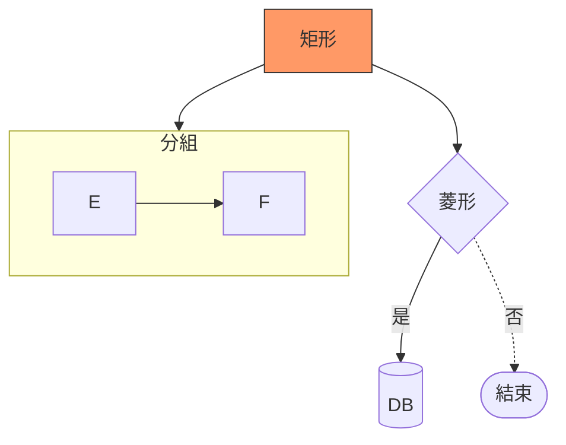
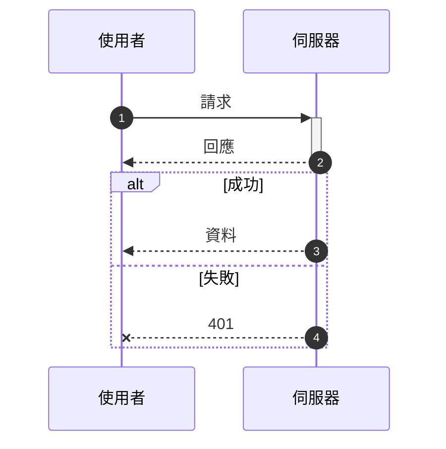
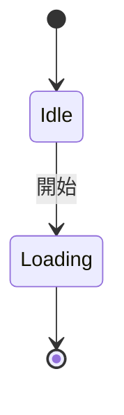
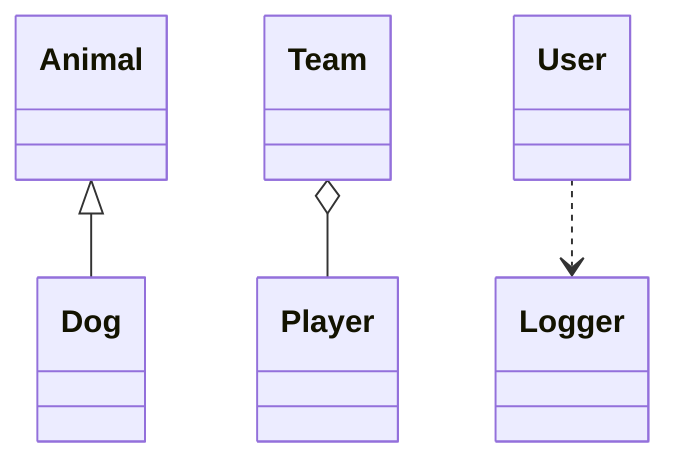
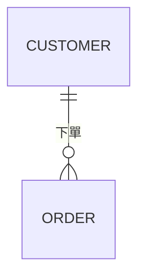

# Mermaid 操作技能（agent 用）

> 教學見 [mermaid.md](mermaid.md)。這份是速查：選對圖、寫對語法、一次成功。

## 選圖

| 需求                       | 用                          |
| :------------------------- | :-------------------------- |
| 流程 / 決策 / 架構分層     | `flowchart TD`              |
| API / 前後端訊息順序       | `sequenceDiagram`           |
| 狀態轉移                   | `stateDiagram-v2`           |
| OOP 類別                   | `classDiagram`              |
| 資料庫 schema              | `erDiagram`                 |
| 排程 / 任務相依            | `gantt`                     |
| 佔比 / 時間軸 / 心智圖     | `pie` / `timeline` / `mindmap` |

不確定就用 flowchart，最寬容。

## 硬規則

1. 標籤含 `( ) [ ] { } , :` → 包雙引號：`A["v2.0 (beta)"]`
2. 小寫 `end` 是保留字，節點名避開（用 `End`）
3. id 用英數，中文放 label：`C1[中文]`
4. 換行用 `<br/>`；連線文字用 `A -->|text| B`
5. 註解 `%%`，只能整行
6. mindmap 靠縮排分層，2 空格，嚴禁 tab
7. 目標環境版本未知 → 避開 `-beta` 圖型與 `look`

## 範本











- ER 基數：`||` 恰一、`|o` 零或一、`}o` 零或多、`}|` 一或多
- 連線：`-->` 實線、`-.->` 虛線、`==>` 粗線、`<-->` 雙向、`---->` 拉長

## 驗證

要交付 SVG/PNG 或沒把握時，先跑：

```bash
npx -y @mermaid-js/mermaid-cli -i in.mmd -o out.svg
```

exit 0 = 語法 OK；錯誤訊息附行號。

## 錯誤 → 修法

| 症狀                    | 修法                              |
| :---------------------- | :-------------------------------- |
| Parse error 在 subgraph | 標籤裸 `end` 或特殊字元沒引號     |
| 連線變圓點/叉叉         | label 開頭是 `o`/`x`，改 `>|text|` |
| 中文 id 噴錯            | id 改英數，中文放 label           |
| mermaid.live 正常、GitHub 不渲染 | GitHub 版本舊，避開新語法 |
