# Mermaid 教學筆記

> 官方網站：<https://mermaid.js.org/>（目前版本 v11.x）｜線上編輯器：<https://mermaid.live>

Mermaid 是一套**免費、開源**的 JavaScript 圖表函式庫，讓你**用類似 Markdown 的文字語法產生圖表**（Diagram as Code）。寫幾行程式碼，就能自動畫出流程圖、時序圖、類別圖、ER 圖、甘特圖等，GitHub、Notion、Obsidian、VS Code 都能直接渲染。

---

## 目錄

| 章節 | 主題                                                             |
| :--- | :--------------------------------------------------------------- |
| 一   | [簡介：Diagram as Code](#一簡介diagram-as-code)                 |
| 二   | [開始使用：三種方式](#二開始使用三種方式)                       |
| 三   | [Flowchart 流程圖](#三flowchart-流程圖)                         |
| 四   | [Sequence Diagram 時序圖](#四sequence-diagram-時序圖)           |
| 五   | [Class Diagram 類別圖](#五class-diagram-類別圖)                 |
| 六   | [State Diagram 狀態機圖](#六state-diagram-狀態機圖)             |
| 七   | [ER Diagram 實體關係圖](#七er-diagram-實體關係圖)               |
| 八   | [Gantt、Pie 與 Timeline](#八ganttpie-與-timeline)               |
| 九   | [其他圖表類型](#九其他圖表類型)                                 |
| 十   | [樣式與主題](#十樣式與主題)                                     |
| 十一 | [常見陷阱 (Gotchas)](#十一常見陷阱-gotchas)                     |
| 十二 | [Mermaid vs. Draw.io 與重點總結](#十二mermaid-vs-drawio-與重點總結) |

---

## 一、簡介：Diagram as Code

### 1. 核心概念

- **文字即圖表**：圖形由純文字描述，Mermaid 負責排版與繪製。
- **好處**：
  - 可版控（diff、code review、git 歷史）
  - 好維護——改文字比拖曳拉線快得多
  - 可自動生成——適合從程式碼、文件直接產圖
- **代價**：版面由引擎自動計算，**無法像素級微調**（要精確排版請用 Draw.io）。

### 2. 支援的圖表類型（節選）

| 分類           | 圖表                                                    |
| :------------- | :------------------------------------------------------ |
| 軟體設計       | Flowchart、Sequence、Class、State、ER、Component（實驗）|
| 專案管理       | Gantt、Timeline、Journey、Kanban                        |
| 資料視覺化     | Pie、Quadrant、XY Chart、Sankey、Block、Packet          |
| 其他           | Mindmap、Git Graph、C4（實驗）                          |

---

## 二、開始使用：三種方式

### 1. 線上編輯器（最快）

- 打開 [mermaid.live](https://mermaid.live)，左邊寫語法、右邊即時預覽。
- 可匯出 SVG / PNG，或產生分享連結（圖表內容編進 URL）。

### 2. Markdown 內嵌

用 fenced code block 標記 `mermaid` 語言即可，**GitHub 原生支援**：

````markdown
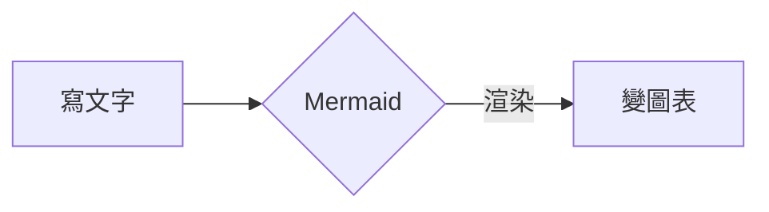
````

- **常見支援環境**：GitHub / GitLab、Notion（Code Block 選 Mermaid）、Obsidian、Typora、MkDocs、Docusaurus、Jupyter。
- **VS Code**：安裝擴充套件 *Markdown Preview Mermaid Support*。

### 3. CLI 匯出（批次轉檔）

```bash
npm install -g @mermaid-js/mermaid-cli

mmdc -i input.mmd -o output.svg   # 也可輸出 .png / .pdf
mmdc -i input.mmd -o out.png -w 1200 -H 800   # 指定寬高
```

---

## 三、Flowchart 流程圖

最常用的圖型。以 `flowchart`（或舊名 `graph`）開頭，**方向**緊跟在後。

### 1. 方向（Direction）

| 語法             | 方向         |
| :--------------- | :----------- |
| `flowchart TB`   | 由上至下     |
| `flowchart BT`   | 由下至上     |
| `flowchart LR`   | 由左至右     |
| `flowchart RL`   | 由右至左     |

### 2. 節點形狀

| 寫法                  | 形狀         | 用途                 |
| :-------------------- | :----------- | :------------------- |
| `A[矩形]`             | 矩形         | 處理、步驟           |
| `A(圓角矩形)`         | 圓角矩形     | 起始／結束           |
| `A([體育場形])`       | 兩端半圓     | 開始／結束（更明顯） |
| `A{菱形}`             | 菱形         | **判斷／決策**       |
| `A[(圓柱)]`           | 圓柱         | **資料庫**           |
| `A((圓形))`           | 圓形         | 連接點 (connector)   |
| `A[[次程序]]`         | 雙側直線框   | 子流程               |
| `A{{六邊形}}`         | 六邊形       | 準備／狀態           |
| `A[/平行四邊形/]`     | 平行四邊形   | 輸入／輸出           |
| `A[/梯形\]`           | 梯形         | 手動輸入等           |

### 3. 連線（Edges / Links）

| 語法           | 樣式                   |
| :------------- | :--------------------- |
| `A --> B`      | 實線箭頭               |
| `A --- B`      | 實線無箭頭             |
| `A -.-> B`     | 虛線箭頭               |
| `A ==> B`      | 粗實線箭頭             |
| `A --o B`      | 實線＋圓點端           |
| `A --x B`      | 實線＋叉叉端           |
| `A <--> B`     | 雙向箭頭               |
| `A -- 說明 --> B` | 線上加文字（舊寫法） |
| `A -->|說明| B`   | 線上加文字（新寫法） |

- **拉長連線**：加長橫線即可，如 `A ----> B` 或 `A -. text .-> B`。
- **一次連多個節點**：`A --> B & C`、`A & B --> C & D`。

### 4. 完整範例

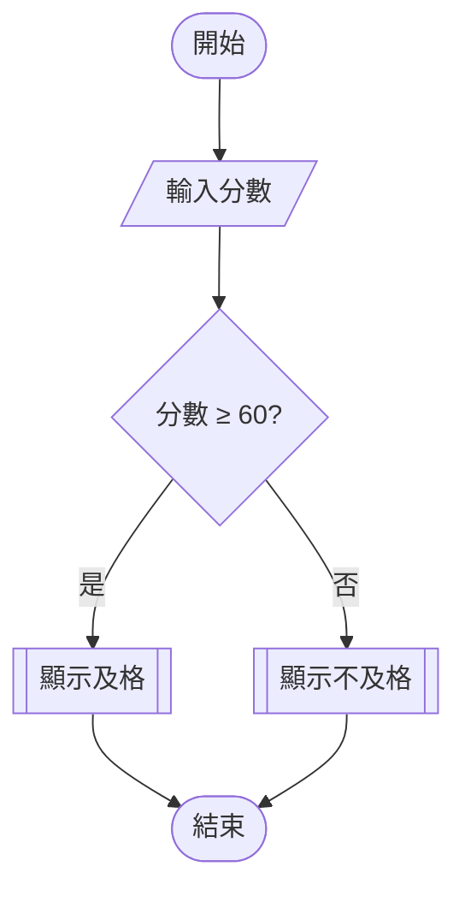

### 5. Subgraph（分組）

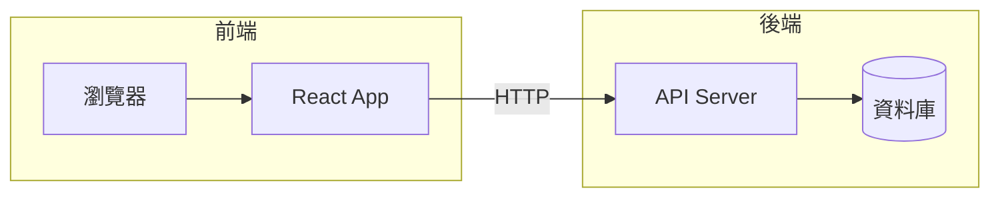

- `subgraph` 內可再指定方向：`subgraph SG [名稱]` + 內部寫 `direction TB`。

### 6. 樣式（classDef）

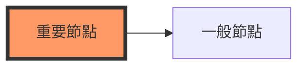

- `classDef 名稱 樣式` 定義樣式，`A:::名稱` 套用。
- 也可直接指定：`style A fill:#f9f,stroke:#333`。

---

## 四、Sequence Diagram 時序圖

描述**物件之間的訊息傳遞順序**，前後端 API 溝通、協定流程必備。

### 1. 訊息類型

| 語法             | 樣式                     |
| :--------------- | :----------------------- |
| `A->>B: 訊息`    | 實線＋實心箭頭（同步）   |
| `B-->>A: 回應`   | 虛線＋實心箭頭（回傳）   |
| `A-x B: 錯誤`    | 實線＋叉叉（失敗）       |
| `A-)B: 訊息`     | 實線＋開放箭頭（非同步） |

### 2. 啟用區塊（Activation）

- 在訊息尾端加 `+` / `-` 可自動啟用／結束生命線區塊：

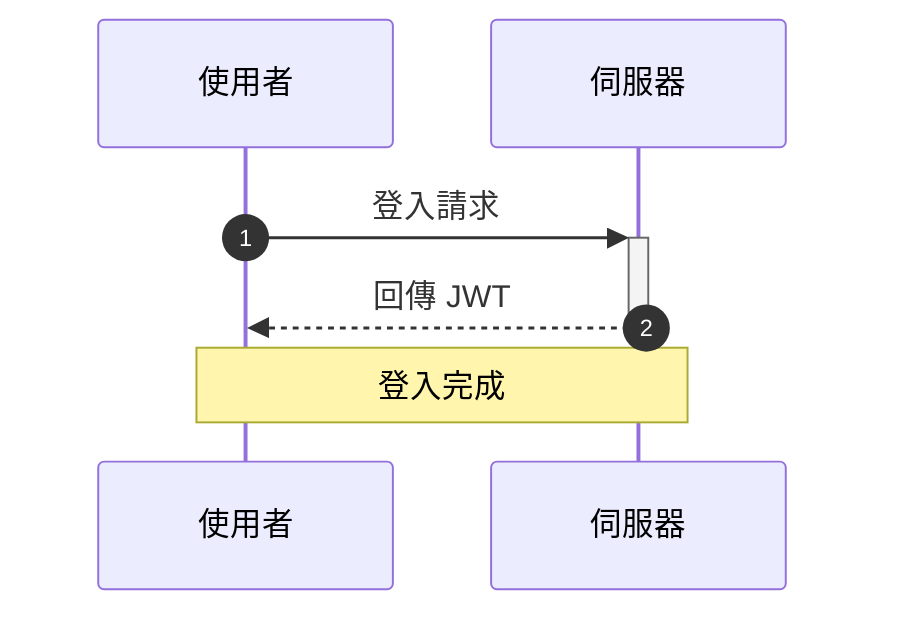

- `autonumber`：自動加上步驟編號。
- `Note over A,B: 文字`、`Note right of A:`：加註解。

### 3. 控制區塊

| 語法                              | 用途             |
| :-------------------------------- | :--------------- |
| `loop 每分鐘` ... `end`           | 迴圈             |
| `alt 成功` / `else 失敗` ... `end`| 條件分支         |
| `opt 可選步驟` ... `end`          | 選擇性流程       |
| `par 並行A` / `and 並行B` ... `end`| 平行處理        |
| `critical 關鍵` / `option 例外` ... `end` | 關鍵流程與例外 |
| `break 中斷條件` ... `end`        | 中斷流程         |
| `rect rgb(200,230,255)` ... `end` | 背景色區塊       |

---

## 五、Class Diagram 類別圖

### 1. 類別與成員

- 可見性符號：`+` public、`-` private、`#` protected、`~` package。

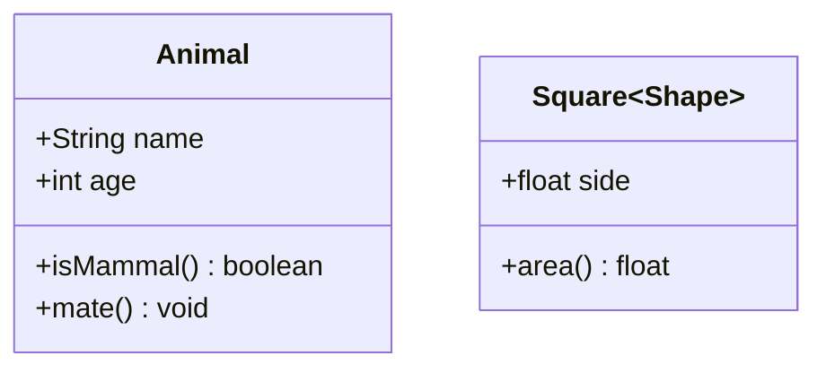

- 泛型用 `~型別~`（如 `Square~Shape~`）。

### 2. 關係

| 語法        | 關係           | 線樣式       |
| :---------- | :------------- | :----------- |
| `A <|-- B`  | 繼承（B 繼承 A）| 實線＋空心三角 |
| `A <|.. B`  | 實現（介面）   | 虛線＋空心三角 |
| `A *-- B`   | 組合 composition | 實線＋實心菱形 |
| `A o-- B`   | 聚合 aggregation | 實線＋空心菱形 |
| `A --> B`   | 關聯           | 實線箭頭     |
| `A ..> B`   | 依賴           | 虛線箭頭     |

### 3. 基數（Cardinality）與方向

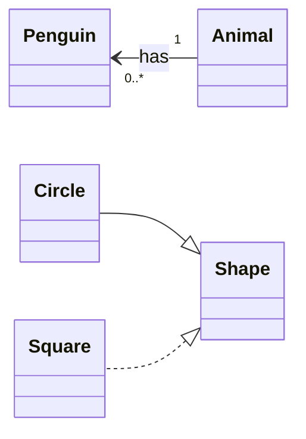

- `direction TB/BT/LR/RL` 控制整體方向。
- 基數寫法：`"1"`、`"0..1"`、`"1..*"`、`"*"`。

---

## 六、State Diagram 狀態機圖

- 用 `stateDiagram-v2`（新版語法）。
- `[*]` 代表初始／結束狀態。

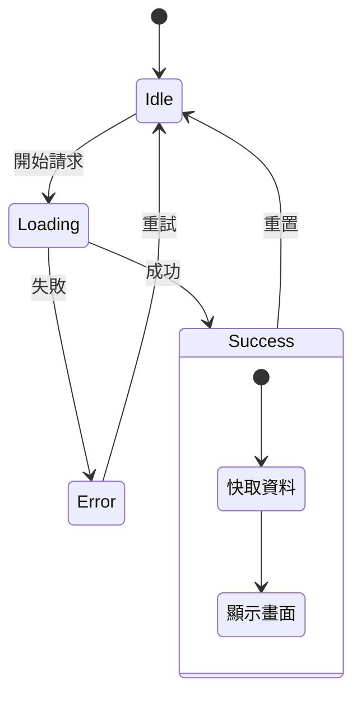

### 重點語法

| 語法                          | 用途                       |
| :---------------------------- | :------------------------- |
| `state X <<choice>>`          | 分支選擇點                 |
| `state F <<fork>>` / `<<join>>` | 平行分岔／合流           |
| `note right of X` ... `end note` | 註解                   |
| `X : 描述文字`                | 在狀態內加說明行           |
| 巢狀（大括號）                | 複合狀態（composite state）|

---

## 七、ER Diagram 實體關係圖

### 1. 關係與基數符號

- 線符號由「左基數—關係—右基數」組成：

| 符號  | 意義         |
| :---- | :----------- |
| `\|\|`| 恰好一個     |
| `\|o` | 零或一個     |
| `}o`  | 零或多個     |
| `}\|` | 一或多個     |

### 2. 範例

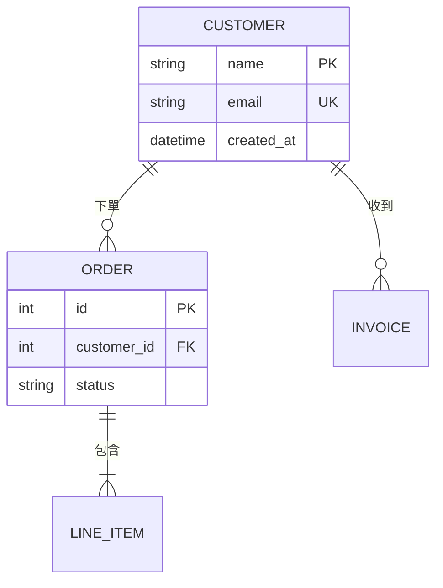

- 屬性格式：`型別 名稱 PK/FK/UK "註解"`（鍵與註解可省略）。

---

## 八、Gantt、Pie 與 Timeline

### 1. Gantt 甘特圖

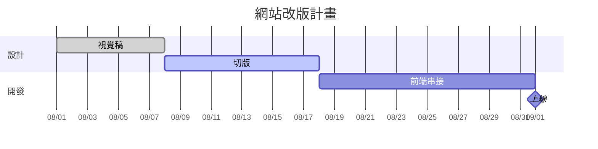

- 任務格式：`名稱 :[旗標,] [id,] [after 前置,] 工期`。
- 旗標：`done`（已完成）、`active`（進行中）、`crit`（關鍵任務，紅色）、`milestone`（里程碑，菱形）。
- `after id` 可建立**任務相依**，排程自動串接。

### 2. Pie 圓餅圖

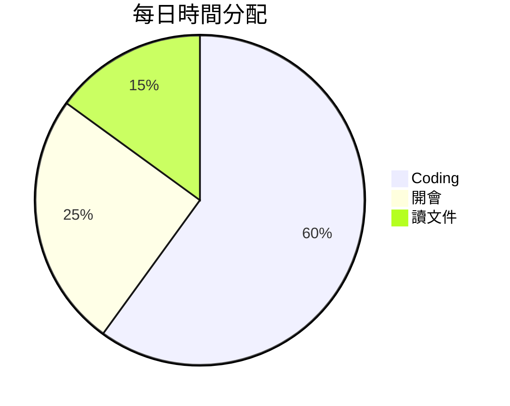

### 3. Timeline 時間軸

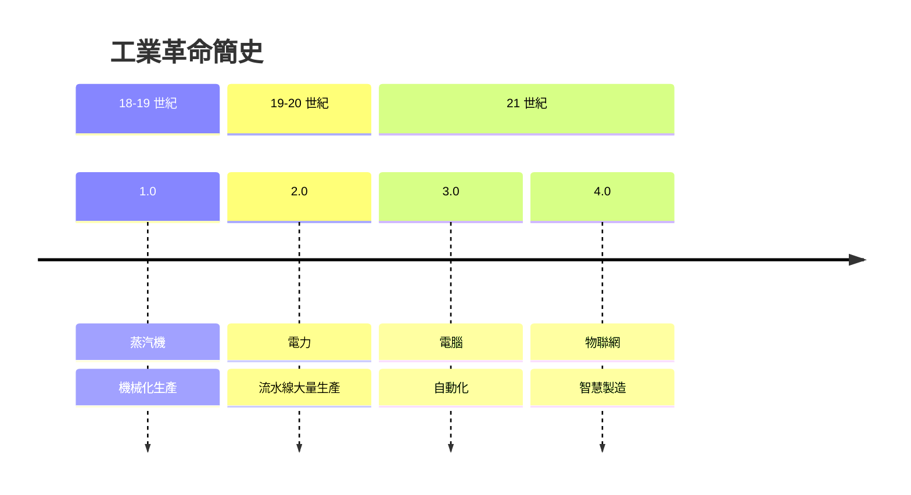

- 同一時間點的多個事件用 `:` 並列。

---

## 九、其他圖表類型

### 1. Mindmap 心智圖（以縮排表達層級）

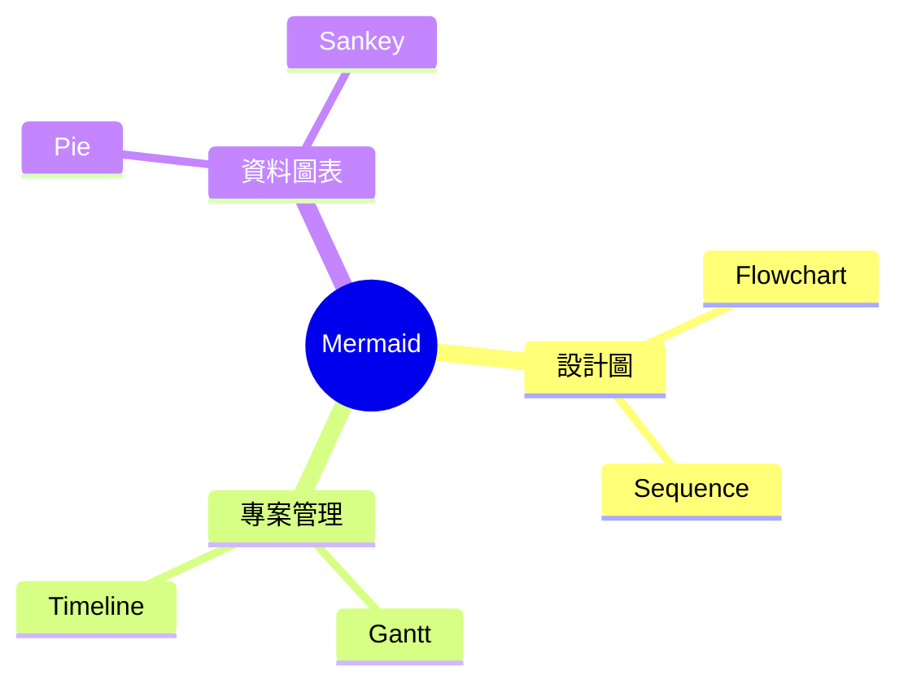

- 節點形狀同 flowchart：`(圓角)`、`[矩形]`、`((圓形))`、`{{六邊形}}` 等。
- **注意**：mindmap 靠縮排分層，不能亂縮。

### 2. User Journey 使用者旅程

格式：`任務名: 分數: 參與者`（分數 1–6 代表滿意度）。

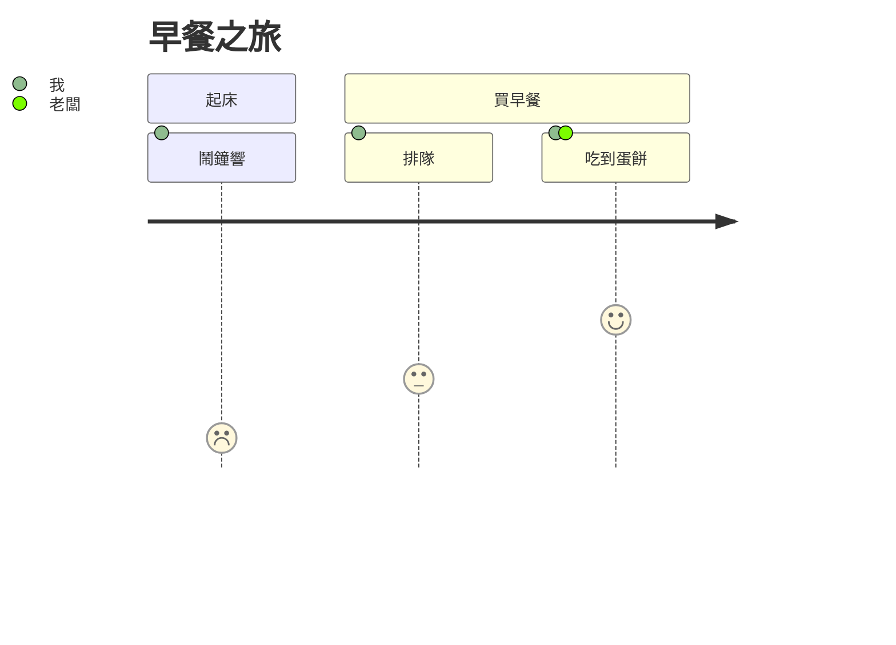

### 3. Git Graph 分支圖

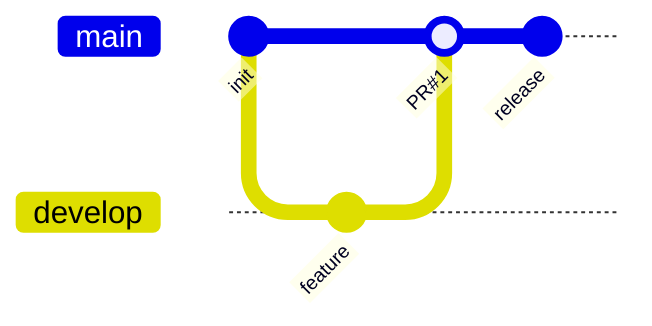

### 4. Quadrant 象限圖

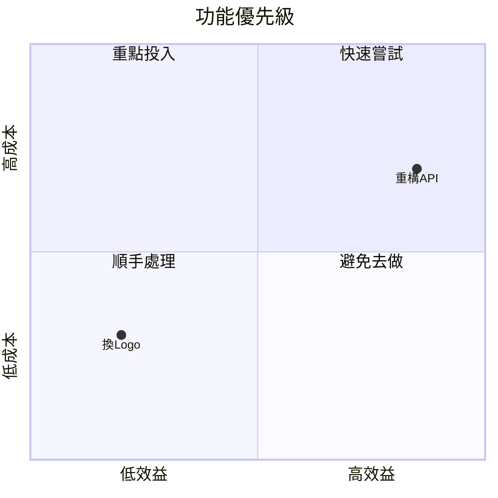

### 5. XY Chart / Sankey

```mermaid
xychart-beta
    title 月營收
    x-axis [1月, 2月, 3月, 4月]
    y-axis "營收(萬)" 0 --> 100
    bar [55, 62, 71, 88]
    line [55, 62, 71, 88]
```

```mermaid
sankey-beta
    電力, 空調, 35
    電力, 照明, 15
    電力, 設備, 50
```

- 另有 `block-beta`（區塊架構圖）、`packet`（網路封包）、Kanban 等新圖型，詳見官方文件。

---

## 十、樣式與主題

### 1. Init Directive（檔案開頭設定主題）

```
%%{init: {"theme": "dark"}}%%
flowchart LR
    A --> B
```

- 內建主題：`default`、`neutral`、`dark`、`forest`、`base`、`mono`。

### 2. Look（v11 新增外觀）

```
%%{init: {"look": "handDrawn", "theme": "neutral"}}%%
flowchart LR
    A[手繪風] --> B[自然]
```

- `look` 選項：`classic`（預設）、`neo`、`handDrawn`（手繪風）。

### 3. 自訂主題變數

```
%%{init: {"theme":"base", "themeVariables": {
  "primaryColor": "#f0f4ff",
  "lineColor": "#5b7def"
}}}%%
```

### 4. 註解

- `%%` 開頭為註解，不會被渲染。

---

## 十一、常見陷阱 (Gotchas)

1. **特殊字元要加引號**：節點文字含 `( )` `[ ]` `{ }` 等符號時，用雙引號包住：`A["含(括號)的文字"]`。
2. **`end` 是保留字**：flowchart 內出現小寫 `end` 會解析失敗，改成 `End` 或加引號 `"end"`。
3. **換行**：用 `<br/>`（`A["第一行<br/>第二行"]`）；HTML 實體可用，如 `#quot;`（雙引號）。
4. **連線文字開頭不可是 `o` 或 `x`**：`A --o B` 會被當成圓點端點；文字前留空格或改用 `-->|text|`。
5. **Mindmap 靠縮排**：階層由縮排決定，複製貼上時容易跑掉。
6. **舊版語法**：`graph TD` 仍可用但建議寫 `flowchart TD`；狀態圖一律用 `stateDiagram-v2`。
7. **版本差異**：GitHub / Notion / VS Code 外掛的 Mermaid 版本不同，新語法（如 `look`、`sankey-beta`）在舊版環境可能不渲染；先在 [mermaid.live](https://mermaid.live) 驗證。

---

## 十二、Mermaid vs. Draw.io 與重點總結

| 面向         | Mermaid                       | Draw.io                        |
| :----------- | :---------------------------- | :----------------------------- |
| 使用方式     | 寫文字語法                    | 拖曳、拉線                     |
| 版控 / diff  | **優**（純文字）              | 差（XML 檔 diff 難讀）         |
| 製圖速度     | 結構單純時極快                | 需手動排版                     |
| 版面控制     | 自動排版，微調受限            | **完全自由**                   |
| 整合場景     | Markdown 文件、README、維基   | 簡報、正式文件、複雜圖         |
| 適用         | 軟體文件、快速溝通、自動生成  | 精美輸出、複雜自由排版         |

### 重點總結

1. **Diagram as Code**：文字可版控、易維護，是 Mermaid 的核心價值。
2. 入門順序建議：**Flowchart → Sequence → Class/ER → Gantt**。
3. Flowchart 三要素：**方向（TB/LR）、節點形狀（中括號／菱形／圓柱）、連線樣式**。
4. Sequence 的 `+`/`-` 啟用 shorthand 與 `alt/loop/par` 區塊最實用。
5. 圖表開頭用 `%%{init: ...}%%` 切主題；v11 可用 `look: handDrawn` 做手繪風。
6. 語法出錯時，先丟進 [mermaid.live](https://mermaid.live) 驗證、檢查特殊字元是否加引號。
7. 要**精確排版**用 Draw.io，要**可版控的文件內嵌圖**用 Mermaid——兩者互補。
